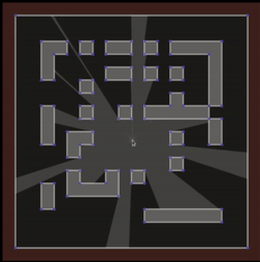

# 2D Visibility Polygon Demo

## Description

This is an implementation of 2d visibility polygon. I ported [this](https://github.com/OneLoneCoder/olcPixelGameEngine/blob/master/Videos/OneLoneCoder_PGE_ShadowCasting2D.cpp) code to ES6+ my own way. You left-click to create blocks and right-click can toggle the source of light that tracks the mouse pointer. I recommend to read articles below.

- "2d Visibility", <i>Red Blob Games</i>, https://www.redblobgames.com/articles/visibility/.

## Demo

You can check out the demo on [HERE](https://apexcel.github.io/2d-visibility-polygon/) or clone the repo then `npm i && npm run start`. It runs on port `3000`.
